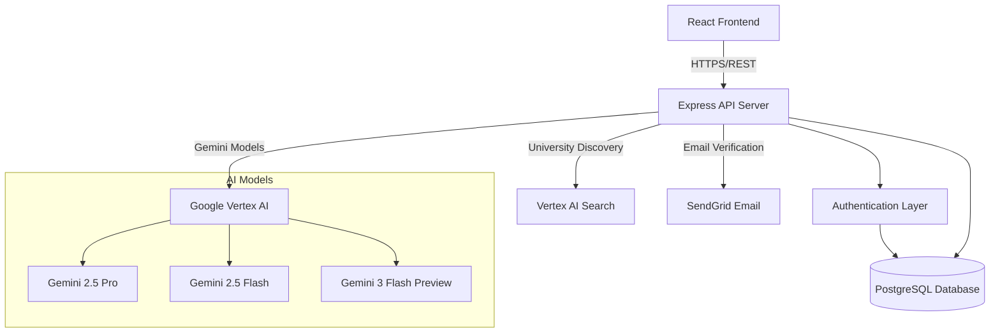
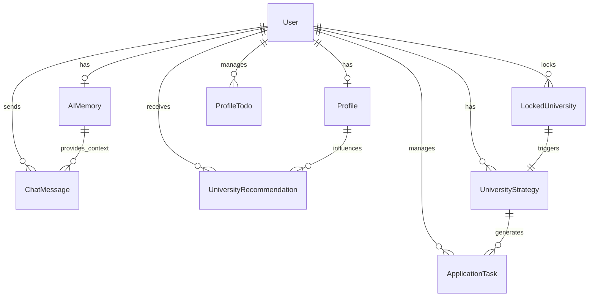

# Design Document: AI Study Abroad Counsellor

## Overview

The AI Study Abroad Counsellor is a full-stack web application that provides personalized guidance for students applying to study abroad programs. The system leverages Google Vertex AI (Gemini models) to deliver intelligent recommendations, application strategies, and interactive counseling through a chat interface.

### Architecture Philosophy

The application follows a three-tier architecture:
- **Frontend**: React-based SPA for user interaction
- **Backend**: Node.js/Express REST API with TypeScript
- **Data Layer**: PostgreSQL with Prisma ORM for type-safe database access
- **AI Layer**: Google Vertex AI integration with multi-model fallback strategy

### Key Design Principles

1. **AI-First Experience**: Every major feature leverages AI for personalization
2. **Token Optimization**: AI Memory system reduces context size and API costs
3. **Resilience**: Multi-model fallback ensures service availability
4. **Type Safety**: TypeScript throughout for compile-time error detection
5. **Caching Strategy**: Profile evaluations, strategies, and todos are cached to reduce AI calls
6. **Progressive Enhancement**: Core features work without AI, enhanced by AI

## Architecture

### System Components



### Deployment Architecture

- **Frontend**: Vercel (static hosting with CDN)
- **Backend**: Render or similar Node.js hosting
- **Database**: Managed PostgreSQL (Render, Supabase, or AWS RDS)
- **AI Services**: Google Cloud Platform (Vertex AI)

### Regional Configuration

The system uses different Vertex AI endpoints for different features:
- **Regional (us-central1)**: Default for chat, recommendations, strategy generation
- **Global with regional endpoint**: AI Search and Gemini 3 Flash Preview
- **Fallback chain**: Gemini 3 → Gemini 2.5 Pro → Gemini 2.5 Flash

## Components and Interfaces

### Authentication System

#### Email/Password Authentication
- **Registration Flow**: User provides email/password → System sends OTP → User verifies → Account activated
- **Login Flow**: User provides credentials → System validates → JWT token issued
- **Password Security**: Bcrypt hashing with salt rounds
- **OTP Management**: 10-minute expiration, hashed storage

#### Google OAuth Authentication
- **Strategy**: Passport.js Google OAuth 2.0 strategy
- **Flow**: User clicks "Sign in with Google" → OAuth redirect → Callback with profile → Account created/linked → JWT issued
- **Profile Mapping**: Google ID stored separately, email verified automatically

#### Session Management
- **Storage**: PostgreSQL-backed sessions (connect-pg-simple)
- **Expiration**: 24-hour cookie lifetime
- **Security**: HTTP-only cookies, secure flag in production

#### JWT Token System
- **Payload**: User ID, email, onboarding status
- **Expiration**: Configurable (default 7 days)
- **Validation**: Middleware checks token on protected routes

### User Profile System

#### Profile Data Model

```typescript
interface Profile {
  // Academic Background
  currentDegree: string;           // e.g., "Bachelor's"
  major: string;                   // e.g., "Computer Science"
  gpa: number;                     // e.g., 3.8
  cgpaScale: string;               // e.g., "4.0", "10.0"
  graduationYear: number;          // e.g., 2024
  
  // Target Program
  educationLevel: string;          // e.g., "Master's", "PhD"
  intendedDegree: string;          // e.g., "MS", "MBA"
  targetField: string;             // e.g., "Data Science"
  targetIntakeYear: number;        // e.g., 2025
  targetIntakeSeason: string;      // e.g., "Fall", "Spring"
  
  // Test Scores
  englishTest: string;             // e.g., "TOEFL", "IELTS"
  englishScore: number;            // e.g., 110
  englishStatus: string;           // e.g., "Completed", "Planned"
  gmatGre: string;                 // e.g., "GRE", "GMAT"
  gmatGreScore: number;            // e.g., 325
  gmatGreStatus: string;           // e.g., "Completed", "Planned"
  
  // Financial
  fundingType: string;             // e.g., "Self-funded", "Scholarship"
  budgetMin: number;               // e.g., 20000
  budgetMax: number;               // e.g., 50000
  budgetCurrency: string;          // e.g., "USD", "EUR"
  
  // Preferences
  preferredCountries: string[];    // e.g., ["USA", "Canada", "UK"]
  
  // Experience
  workExperience: number;          // Years, e.g., 2
  researchExperience: boolean;     // true/false
  
  // Document Status
  sopStatus: string;               // e.g., "Not Started", "In Progress"
  lorStatus: string;               // e.g., "Not Started", "Completed"
  resumeStatus: string;            // e.g., "Ready", "Needs Update"
  
  // Caching
  aiEvaluationCache: JSON;         // Cached AI evaluation
  aiEvaluationDate: DateTime;      // When evaluation was cached
  aiTodosCache: JSON;              // Cached AI-generated todos
  profileHash: string;             // Hash for cache invalidation
}
```

#### Profile Hash Calculation
- **Purpose**: Detect meaningful profile changes to invalidate caches
- **Fields Included**: Academic info, test scores, target program, budget, countries
- **Algorithm**: SHA-256 hash of concatenated key fields
- **Usage**: Compare new hash with stored hash on profile update

### AI Memory System

#### Purpose
Reduce token usage in AI interactions by maintaining a condensed context instead of sending full profile and history.

#### AI Memory Structure
```typescript
interface AIMemory {
  condensedProfile: string;        // Max 150 chars, e.g., "CS grad, 3.8 GPA, GRE 325, targeting MS Data Science in USA/Canada, $30-50k budget"
  currentStage: string;            // e.g., "Exploring", "Shortlisting", "Applying"
  shortlistedUnis: string[];       // e.g., ["MIT", "Stanford", "CMU"]
  lockedUnis: string[];            // e.g., ["MIT", "Stanford"]
  keyPreferences: JSON;            // { countries: ["USA", "Canada"], budgetRange: "30-50k USD" }
  lastUpdated: DateTime;           // Timestamp for staleness detection
}
```

#### Memory Generation Logic
1. **Profile Condensation**: Extract key facts (degree, GPA, tests, target, budget, countries)
2. **Stage Detection**: Analyze user actions (no unis → Exploring, has recommendations → Shortlisting, has locked → Applying)
3. **University Lists**: Extract names from recommendations and locked universities
4. **Preference Extraction**: Summarize countries, budget, and other key filters

#### Memory Update Triggers
- Profile update (regenerate condensedProfile)
- University locked/unlocked (update lockedUnis, currentStage)
- Recommendations added/removed (update shortlistedUnis)
- Manual refresh (user action or periodic)

### AI Counselor Chat System

#### Chat Architecture


```typescript
interface ChatMessage {
  id: string;
  userId: string;
  role: 'user' | 'assistant';
  content: string;
  createdAt: DateTime;
}

interface ChatContext {
  aiMemory: AIMemory;              // Condensed user context
  recentHistory: ChatMessage[];    // Last 10 messages (20 turns)
  systemPrompt: string;            // Role and capabilities
}
```

#### System Prompt Design
The AI Counselor is instructed to:
- Act as an experienced study abroad counselor
- Provide personalized guidance based on user profile
- Suggest universities, application strategies, and timeline
- Help with document preparation (SOP, LOR guidance)
- Conduct mock interviews
- Be encouraging and supportive

#### Context Management
1. **AI Memory**: Always included (150 chars max)
2. **Recent History**: Last 10 user-assistant pairs (20 messages)
3. **System Prompt**: Defines role and capabilities
4. **Total Context**: ~2000-3000 tokens (vs 10k+ with full profile)

#### Multi-Model Fallback Strategy
```typescript
async function generateChatResponse(context: ChatContext): Promise<string> {
  const models = [
    { name: 'gemini-2.5-pro', location: 'regional' },
    { name: 'gemini-2.5-flash', location: 'regional' },
    { name: 'gemini-3-flash-preview', location: 'global' }
  ];
  
  for (const model of models) {
    try {
      return await callVertexAI(model, context);
    } catch (error) {
      if (isModelNotFound(error) || isVertexHtmlError(error)) {
        continue; // Try next model
      }
      throw error; // Non-recoverable error
    }
  }
  
  throw new Error('All AI models failed');
}
```

#### Error Detection
- **Model Not Found (404)**: Model not enabled for project
- **HTML Error**: Wrong endpoint or authentication issue
- **Rate Limit**: Exponential backoff (not implemented yet)

### University Discovery System

#### Vertex AI Search Integration
- **Service**: Google Vertex AI Search (formerly Enterprise Search)
- **Data Source**: University information corpus
- **Query Processing**: Natural language queries converted to search parameters
- **Response**: Structured university data with metadata

#### Two-Step Search Process
1. **Step 1 - Google Search Grounding**: Query with Google Search tool enabled, returns prose with university information
2. **Step 2 - Structured Extraction**: Parse prose into JSON with schema validation

#### Search Query Construction
```typescript
interface SearchQuery {
  userQuery: string;               // e.g., "affordable universities in Canada for computer science"
  profileContext: {
    targetField: string;
    intendedDegree: string;
    budgetRange: string;
    preferredCountries: string[];
  };
}

function buildSearchPrompt(query: SearchQuery): string {
  return `Find universities matching: ${query.userQuery}
  
  Student profile:
  - Field: ${query.profileContext.targetField}
  - Degree: ${query.profileContext.intendedDegree}
  - Budget: ${query.profileContext.budgetRange}
  - Countries: ${query.profileContext.preferredCountries.join(', ')}
  
  Return 6-12 universities with name, location, highlights, and source links.`;
}
```

#### Response Schema
```typescript
interface AiSearchResult {
  universities: AiSearchUniversityItem[];
}

interface AiSearchUniversityItem {
  id: string;                      // Slug, e.g., "university-of-toronto"
  name: string;                    // "University of Toronto"
  country: string;                 // "Canada"
  costLevel: string;               // "Low" | "Medium" | "High"
  acceptanceLikelihood: string;    // "Low" | "Medium" | "High"
  riskLevel: string;               // "Low" | "Medium" | "High"
  tuition: number | null;          // e.g., 45000
  livingCost: number | null;       // e.g., 15000
  currency: string;                // "USD", "CAD", etc.
  whyItFits: string;               // AI-generated explanation
  keyRisks: string[];              // Array of risk factors
  sourceLinks?: string[];          // URLs to official pages
}
```

#### Country Filtering
- **Strict Enforcement**: Only return universities in user's preferred countries
- **Validation**: Post-processing filter to remove any universities outside preferred countries
- **User Override**: Allow manual country selection in UI

### University Recommendation System

#### Recommendation Generation


When AI Search returns universities, the system generates detailed recommendations:

```typescript
interface UniversityRecommendation {
  universityId: string;            // Slug
  universityName: string;          // Full name
  country: string;                 // Country
  category: 'Dream' | 'Target' | 'Safe';
  fitScore: number;                // 0-100
  whyItFits: string;               // Detailed explanation
  risks: string[];                 // Risk factors
  acceptanceChance: string;        // "Low" | "Medium" | "High"
  costLevel: string;               // "Low" | "Medium" | "High"
  costAnalysis: string;            // Detailed breakdown
  tuition: number;                 // Annual tuition
  livingCost: number;              // Annual living cost
  currency: string;                // Currency code
  nextSteps: string;               // Recommended actions
  chatMessageId?: string;          // Link to generating message
}
```

#### Categorization Logic
- **Dream (Reach)**: Fit score 80-100, acceptance chance Low, user's GPA/scores below typical admits
- **Target (Match)**: Fit score 60-79, acceptance chance Medium, user's profile matches typical admits
- **Safe (Safety)**: Fit score 40-59, acceptance chance High, user's profile exceeds typical admits

#### Fit Score Calculation
The AI considers:
1. **Academic Match** (30%): GPA, test scores vs university requirements
2. **Program Alignment** (25%): Target field vs available programs
3. **Financial Fit** (20%): Budget vs total cost
4. **Geographic Preference** (15%): Preferred countries
5. **Experience Match** (10%): Work/research experience vs program expectations

#### Risk Assessment
Common risks identified:
- High competition for program
- Budget constraints (cost exceeds budget)
- Test score gaps (below typical admits)
- Visa/immigration challenges
- Limited scholarship opportunities
- Geographic distance/cultural adjustment

### Application Strategy System

#### Strategy Generation
When a user locks a university, the AI generates a comprehensive application strategy:

```typescript
interface UniversityStrategy {
  universityId: string;
  content: string;                 // Detailed strategy text (markdown)
  requiredDocuments: Document[];   // List of required documents
  timeline: Milestone[];           // Application timeline
  aiGuidance: {
    sop: string[];                 // SOP writing tips
    exams: string[];               // Test preparation advice
    forms: string[];               // Application form guidance
  };
}

interface Document {
  name: string;                    // e.g., "Statement of Purpose"
  description: string;             // Requirements and tips
  deadline: string;                // Relative deadline, e.g., "2 months before application"
  priority: 'High' | 'Medium' | 'Low';
}

interface Milestone {
  title: string;                   // e.g., "Complete TOEFL"
  description: string;             // Details
  timeframe: string;               // e.g., "3-4 months before deadline"
  dependencies: string[];          // Other milestones that must be completed first
}
```

#### Strategy Prompt Design
```typescript
function buildStrategyPrompt(user: User, profile: Profile, university: string): string {
  return `Create a comprehensive application strategy for ${user.fullName} applying to ${university}.

Profile Summary:
- Current: ${profile.currentDegree} in ${profile.major}, GPA ${profile.gpa}
- Target: ${profile.intendedDegree} in ${profile.targetField}
- Tests: ${profile.englishTest} ${profile.englishScore}, ${profile.gmatGre} ${profile.gmatGreScore}
- Budget: ${profile.budgetMin}-${profile.budgetMax} ${profile.budgetCurrency}
- Experience: ${profile.workExperience} years work, research: ${profile.researchExperience}

Generate:
1. Overall strategy (2-3 paragraphs)
2. Required documents with descriptions
3. Timeline with milestones (work backwards from application deadline)
4. Specific guidance for SOP, exams, and forms

Format as JSON with fields: content, requiredDocuments, timeline, aiGuidance`;
}
```

#### Strategy Caching
- **Cache Key**: userId + universityId
- **Invalidation**: Profile changes (hash mismatch)
- **TTL**: No expiration (manual refresh only)

### Task Management System

#### Task Types
1. **Profile Todos**: Tasks to improve profile (take tests, gain experience, prepare documents)
2. **Application Tasks**: University-specific tasks (write SOP, submit forms, request LOR)

#### Profile Todo Structure
```typescript
interface ProfileTodo {
  title: string;                   // e.g., "Take TOEFL"
  description: string;             // Details and tips
  category: 'Test' | 'Profile' | 'Documents' | 'General';
  completed: boolean;
  isAiGenerated: boolean;          // true if created by AI
}
```

#### Application Task Structure
```typescript
interface ApplicationTask {
  universityId: string;            // Which university this task is for
  title: string;                   // e.g., "Write Statement of Purpose"
  description: string;             // Specific requirements
  priority: 'High' | 'Medium' | 'Low';
  category: 'Documentation' | 'Test' | 'SOP' | 'Forms' | 'Other';
  deadlineHint: string;            // e.g., "2 weeks before application deadline"
  completed: boolean;
  isAiGenerated: boolean;
}
```

#### Task Generation from Strategy
When a strategy is created, the system automatically generates tasks:
1. Parse `requiredDocuments` → Create Documentation tasks
2. Parse `timeline` → Create milestone-based tasks
3. Parse `aiGuidance` → Create guidance-related tasks
4. Set priorities based on deadlines and dependencies

#### Task Routing Logic
```typescript
function routeTask(task: Task, user: User): 'profile' | 'application' {
  // Profile tasks: improve overall profile
  if (task.category === 'Test' && !user.lockedUniversities.length) {
    return 'profile';
  }
  
  // Application tasks: specific to a university
  if (task.universityId) {
    return 'application';
  }
  
  // Default: profile
  return 'profile';
}
```

### Mock Interview System

#### Interview Flow
1. **Initialization**: User requests mock interview for specific university or general
2. **Question Generation**: AI generates 3-5 relevant interview questions
3. **User Response**: User types or speaks response
4. **AI Feedback**: AI evaluates response and provides constructive feedback
5. **Iteration**: Continue with next question or end session

#### Question Types
- **Motivation**: "Why do you want to study at [University]?"
- **Academic**: "Describe your research experience in [Field]"
- **Career**: "What are your career goals after graduation?"
- **Behavioral**: "Tell me about a challenge you overcame"
- **Technical**: Field-specific questions based on target program

#### Feedback Criteria
- **Content**: Relevance, depth, specificity
- **Structure**: Clear introduction, body, conclusion
- **Delivery**: Confidence indicators (in text: clarity, conciseness)
- **Improvement**: Specific suggestions for enhancement

### SOP Generation System

#### SOP Structure
Standard SOP sections:
1. **Introduction**: Hook, background, motivation
2. **Academic Background**: Education, achievements, relevant coursework
3. **Professional Experience**: Work, internships, projects
4. **Research Experience**: Publications, lab work, independent research
5. **Why This Program**: Specific reasons for choosing university/program
6. **Career Goals**: Short-term and long-term aspirations
7. **Conclusion**: Summary and enthusiasm

#### AI Assistance Modes
1. **Outline Generation**: Create section-by-section outline
2. **Content Suggestions**: Provide example content for each section
3. **Draft Review**: Analyze user-written draft and provide feedback
4. **Revision Suggestions**: Specific improvements for clarity, impact, structure

#### SOP Prompt Template


```typescript
function buildSOPPrompt(mode: 'outline' | 'content' | 'review', profile: Profile, university: string, draft?: string): string {
  const baseContext = `Student Profile:
- Background: ${profile.currentDegree} in ${profile.major}
- Target: ${profile.intendedDegree} in ${profile.targetField} at ${university}
- Experience: ${profile.workExperience} years work, research: ${profile.researchExperience}`;

  if (mode === 'outline') {
    return `${baseContext}

Create a detailed SOP outline with 7 sections. For each section, provide:
- Section title
- Key points to cover (3-5 bullet points)
- Suggested length (words)`;
  }
  
  if (mode === 'content') {
    return `${baseContext}

Generate example content for each SOP section. Make it specific to the student's profile and target program.`;
  }
  
  if (mode === 'review') {
    return `${baseContext}

Review this SOP draft and provide feedback:

${draft}

Analyze:
1. Strengths (what works well)
2. Weaknesses (what needs improvement)
3. Specific suggestions for each section
4. Overall impression and score (1-10)`;
  }
}
```

## Data Models

### Database Schema

#### User Model
```prisma
model User {
  id                      String    @id @default(uuid())
  fullName                String
  email                   String    @unique
  password                String?   // Null for Google OAuth users
  googleId                String?   @unique
  emailVerified           Boolean   @default(true)
  otpCodeHash             String?
  otpExpiresAt            DateTime?
  onboardingCompleted     Boolean   @default(false)
  createdAt               DateTime  @default(now())
  updatedAt               DateTime  @updatedAt
  
  // Relations
  profile                 Profile?
  aiMemory                AIMemory?
  chatMessages            ChatMessage[]
  universityRecommendations UniversityRecommendation[]
  lockedUniversities      LockedUniversity[]
  universityStrategies    UniversityStrategy[]
  applicationTasks        ApplicationTask[]
  profileTodos            ProfileTodo[]
  todos                   Todo[]
}
```

#### Profile Model
```prisma
model Profile {
  id                 String    @id @default(uuid())
  userId             String    @unique
  
  // Academic
  currentDegree      String
  major              String
  gpa                Float?
  cgpaScale          String?
  graduationYear     Int
  educationLevel     String
  
  // Target
  intendedDegree     String
  targetField        String
  targetIntakeYear   Int
  targetIntakeSeason String?
  
  // Tests
  englishTest        String?
  englishScore       Float?
  englishStatus      String?
  gmatGre            String?
  gmatGreScore       Float?
  gmatGreStatus      String?
  
  // Financial
  fundingType        String
  budgetMin          Float?
  budgetMax          Float?
  budgetCurrency     String    @default("USD")
  
  // Preferences
  preferredCountries String[]
  
  // Experience
  workExperience     Int?
  researchExperience Boolean   @default(false)
  
  // Documents
  sopStatus          String
  lorStatus          String?
  resumeStatus       String?
  
  // Caching
  aiEvaluationCache  Json?
  aiEvaluationDate   DateTime?
  aiTodosCache       Json?
  profileHash        String?
  
  createdAt          DateTime  @default(now())
  updatedAt          DateTime  @updatedAt
  user               User      @relation(fields: [userId], references: [id], onDelete: Cascade)
  
  @@index([targetField, intendedDegree, targetIntakeYear])
  @@index([budgetMin, budgetMax])
  @@index([preferredCountries])
}
```

#### AIMemory Model
```prisma
model AIMemory {
  id                String    @id @default(uuid())
  userId            String    @unique
  condensedProfile  String    // Max 150 chars
  currentStage      String
  shortlistedUnis   String[]
  lockedUnis        String[]
  keyPreferences    Json?
  lastUpdated       DateTime  @default(now()) @updatedAt
  user              User      @relation(fields: [userId], references: [id], onDelete: Cascade)
}
```

#### UniversityRecommendation Model
```prisma
model UniversityRecommendation {
  id              String   @id @default(uuid())
  userId          String
  universityId    String   // Slug
  universityName  String
  country         String?
  category        String   // "Dream" | "Target" | "Safe"
  fitScore        Int      // 0-100
  whyItFits       String
  risks           String[]
  acceptanceChance String  // "Low" | "Medium" | "High"
  costLevel       String   // "Low" | "Medium" | "High"
  costAnalysis    String?
  tuition         Float?
  livingCost      Float?
  currency        String?
  nextSteps       String?
  chatMessageId   String?
  createdAt       DateTime @default(now())
  user            User     @relation(fields: [userId], references: [id], onDelete: Cascade)
  
  @@unique([userId, universityId])
  @@index([userId, category])
}
```

#### LockedUniversity Model
```prisma
model LockedUniversity {
  id                   String   @id @default(uuid())
  userId               String
  universityId         String
  universityName       String?
  lockedAt             DateTime @default(now())
  applicationSubmitted Boolean  @default(false)
  user                 User     @relation(fields: [userId], references: [id], onDelete: Cascade)
  
  @@unique([userId, universityId])
}
```

#### UniversityStrategy Model
```prisma
model UniversityStrategy {
  id                String   @id @default(uuid())
  userId            String
  universityId      String
  content           String   // Markdown text
  requiredDocuments Json?    // Array of documents
  timeline          Json?    // Array of milestones
  aiGuidance        Json?    // { sop, exams, forms }
  createdAt         DateTime @default(now())
  updatedAt         DateTime @updatedAt
  user              User     @relation(fields: [userId], references: [id], onDelete: Cascade)
  
  @@unique([userId, universityId])
  @@index([userId, universityId])
}
```

#### ApplicationTask Model
```prisma
model ApplicationTask {
  id            String   @id @default(uuid())
  userId        String
  universityId  String
  title         String
  description   String?
  priority      String   // "High" | "Medium" | "Low"
  category      String   // "Documentation" | "Test" | "SOP" | "Forms" | "Other"
  deadlineHint  String?
  completed     Boolean  @default(false)
  isAiGenerated Boolean  @default(false)
  createdAt     DateTime @default(now())
  updatedAt     DateTime @updatedAt
  user          User     @relation(fields: [userId], references: [id], onDelete: Cascade)
  
  @@unique([userId, universityId, title])
  @@index([userId, universityId])
}
```

#### ProfileTodo Model
```prisma
model ProfileTodo {
  id            String   @id @default(uuid())
  userId        String
  title         String
  description   String?
  category      String   // "Test" | "Profile" | "Documents" | "General"
  completed     Boolean  @default(false)
  isAiGenerated Boolean  @default(false)
  createdAt     DateTime @default(now())
  updatedAt     DateTime @updatedAt
  user          User     @relation(fields: [userId], references: [id], onDelete: Cascade)
  
  @@index([userId])
}
```

#### ChatMessage Model
```prisma
model ChatMessage {
  id        String   @id @default(uuid())
  userId    String
  role      String   // 'user' | 'assistant'
  content   String
  createdAt DateTime @default(now())
  user      User     @relation(fields: [userId], references: [id], onDelete: Cascade)
  
  @@index([userId, createdAt])
}
```

### Data Relationships




## Correctness Properties

*A property is a characteristic or behavior that should hold true across all valid executions of a system—essentially, a formal statement about what the system should do. Properties serve as the bridge between human-readable specifications and machine-verifiable correctness guarantees.*

### Authentication and Security Properties

Property 1: Password hashing invariant
*For any* password stored in the system, the stored value should be hashed and should not match the plaintext password
**Validates: Requirements 1.8**

Property 2: OTP expiration enforcement
*For any* OTP code, if the current time exceeds otpExpiresAt, then verification attempts should be rejected
**Validates: Requirements 1.4, 1.6**

Property 3: Email verification round trip
*For any* user registration with email/password, generating an OTP, then verifying with that OTP should result in emailVerified being true
**Validates: Requirements 1.1, 1.5**

Property 4: JWT authentication
*For any* valid user credentials, successful login should return a JWT token that can be used to access protected routes
**Validates: Requirements 1.3, 1.7**

Property 5: OAuth email verification
*For any* user created via Google OAuth, the emailVerified field should be true immediately upon creation
**Validates: Requirements 1.2**

### Profile Management Properties

Property 6: Profile data persistence
*For any* complete profile submission, all required fields (current degree, major, GPA, target field, budget, preferred countries, etc.) should be stored and retrievable
**Validates: Requirements 2.3**

Property 7: Profile validation
*For any* profile submission with missing required fields, the system should reject it with validation errors
**Validates: Requirements 2.2**

Property 8: Budget validation
*For any* profile with budget values, negative numbers should be rejected
**Validates: Requirements 2.7**

Property 9: Onboarding completion
*For any* user who submits a complete profile, the onboardingCompleted flag should be set to true
**Validates: Requirements 2.4**

Property 10: Preferred countries array handling
*For any* profile, preferred countries should be stored as an array and retrieved as an array with all elements preserved
**Validates: Requirements 2.6**

### Cache Invalidation Properties

Property 11: Profile hash-based cache invalidation
*For any* profile update that changes key fields (academic info, test scores, target program, budget, countries), the profile hash should change and all cached data (aiEvaluationCache, aiTodosCache, strategies) should be invalidated
**Validates: Requirements 2.5, 8.7, 10.4, 11.4, 11.5**

Property 12: Cache hit avoidance after invalidation
*For any* profile with invalidated cache, subsequent requests for evaluations or todos should call the AI and not return stale cached data
**Validates: Requirements 11.6**

### AI Memory Properties

Property 13: AI Memory condensed profile length
*For any* AI Memory generation or update, the condensedProfile field should be at most 150 characters
**Validates: Requirements 4.1**

Property 14: AI Memory synchronization
*For any* significant user action (profile update, university lock/unlock, recommendation add/remove), the AI Memory should be updated to reflect the new state
**Validates: Requirements 4.5, 4.6, 4.7, 7.2, 3.10**

Property 15: AI Memory creation on first chat
*For any* user without AI Memory who sends a chat message, AI Memory should be generated from their profile and application state before processing the message
**Validates: Requirements 3.3**

Property 16: AI Memory usage in chat
*For any* chat request, the system should use AI Memory (condensed context) instead of full profile data when constructing the AI prompt
**Validates: Requirements 3.2, 4.8**

### Chat System Properties

Property 17: Chat message persistence
*For any* chat message (user or assistant), it should be stored with correct role, content, userId, and timestamp
**Validates: Requirements 3.1, 3.7**

Property 18: Chat context window
*For any* chat request, the context should include at most the last 10 user-assistant message pairs (20 messages total) plus AI Memory
**Validates: Requirements 3.8**

Property 19: AI model fallback chain
*For any* AI request where the primary model (Gemini 2.5 Pro) fails with 404 or HTML error, the system should attempt fallback models in order: Gemini 2.5 Flash, then Gemini 3 Flash Preview
**Validates: Requirements 3.5, 3.6, 15.1**

### University Recommendation Properties

Property 20: Recommendation structure validation
*For any* university recommendation, it must have: category in {Dream, Target, Safe}, fitScore in [0, 100], non-empty whyItFits, acceptanceChance in {Low, Medium, High}, costLevel in {Low, Medium, High}, and risks as an array
**Validates: Requirements 5.2, 5.3, 5.4, 5.5, 5.6, 5.7**

Property 21: Country filtering enforcement
*For any* university recommendation, the country must be in the user's preferredCountries array
**Validates: Requirements 5.10**

Property 22: Recommendation uniqueness
*For any* user, there should be at most one recommendation per universityId
**Validates: Requirements 5.11**

Property 23: Cost analysis completeness
*For any* university recommendation, if cost data is provided, it should include tuition, livingCost, and currency
**Validates: Requirements 5.8**

### Shortlist Management Properties

Property 24: Shortlist grouping and sorting
*For any* shortlist query, recommendations should be grouped by category (Dream, Target, Safe) and sorted by fitScore (descending) within each category
**Validates: Requirements 6.3, 6.4**

Property 25: Shortlist filtering
*For any* shortlist query with filters (category, country, costLevel), only recommendations matching all specified filters should be returned
**Validates: Requirements 6.5**

### University Locking Properties

Property 26: Lock operation side effects
*For any* university lock operation, the system should: create a LockedUniversity record with timestamp, update AI Memory with the university name, and generate an Application Strategy
**Validates: Requirements 7.1, 7.2, 8.1**

Property 27: Unlock cascade deletion
*For any* university unlock operation, the system should delete the LockedUniversity record and all associated ApplicationTasks and UniversityStrategy
**Validates: Requirements 7.3, 7.4**

Property 28: Locked university uniqueness
*For any* user, there should be at most one LockedUniversity record per universityId
**Validates: Requirements 7.5**

### Application Strategy Properties

Property 29: Strategy structure completeness
*For any* generated Application Strategy, it must include: non-empty content, requiredDocuments as valid JSON array, timeline as valid JSON array, and aiGuidance as valid JSON object with sop, exams, and forms fields
**Validates: Requirements 8.2, 8.3, 8.4, 8.5**

Property 30: Strategy caching
*For any* university with an existing strategy, subsequent strategy requests should return the cached version without calling the AI
**Validates: Requirements 8.6**

Property 31: Strategy uniqueness
*For any* user, there should be at most one UniversityStrategy per universityId
**Validates: Requirements 8.8**

### Task Management Properties

Property 32: Task creation from strategy
*For any* generated Application Strategy, the system should create ApplicationTasks based on the requiredDocuments and timeline
**Validates: Requirements 9.1**

Property 33: Task field validation
*For any* ApplicationTask, priority must be in {High, Medium, Low} and category must be in {Documentation, Test, SOP, Forms, Other}
**Validates: Requirements 9.3, 9.4**

Property 34: Task uniqueness
*For any* user and universityId, task titles should be unique
**Validates: Requirements 9.8**

Property 35: Task AI generation flag
*For any* task, if created by AI it should have isAiGenerated=true, if created manually it should have isAiGenerated=false
**Validates: Requirements 9.6, 9.7**

Property 36: Task filtering and sorting
*For any* task query for a specific university, results should be filtered by universityId and sorted by priority (High > Medium > Low) then deadline
**Validates: Requirements 9.9**

### Profile Todo Properties

Property 37: Todo category validation
*For any* ProfileTodo, category must be in {Test, Profile, Documents, General}
**Validates: Requirements 10.2**

Property 38: Todo caching with profile hash
*For any* profile evaluation that generates todos, the todos should be cached in aiTodosCache along with the current profileHash
**Validates: Requirements 10.3**

Property 39: Todo AI generation flag
*For any* todo, if created by AI it should have isAiGenerated=true, if created manually it should have isAiGenerated=false
**Validates: Requirements 10.6, 10.7**

Property 40: Todo filtering
*For any* todo query with filters (category, completed status), only todos matching all specified filters should be returned
**Validates: Requirements 10.8**

### Profile Evaluation Properties

Property 41: Evaluation caching with timestamp
*For any* profile evaluation, the result should be stored in aiEvaluationCache and the timestamp in aiEvaluationDate
**Validates: Requirements 11.2, 11.3**

Property 42: Evaluation structure
*For any* profile evaluation, it should include strengths, weaknesses, and improvement recommendations
**Validates: Requirements 11.7**

### Mock Interview Properties

Property 43: Interview question generation
*For any* mock interview request, the AI should generate questions based on the user's profile (target field, universities, experience)
**Validates: Requirements 12.1**

Property 44: Interview feedback generation
*For any* user response to an interview question, the AI should provide constructive feedback
**Validates: Requirements 12.2**

Property 45: Interview persistence
*For any* mock interview session, all questions and responses should be stored in chat history
**Validates: Requirements 12.5**

### SOP Assistance Properties

Property 46: SOP outline generation
*For any* SOP outline request, the AI should generate an outline with key sections (Introduction, Academic Background, Experience, Why This Program, Career Goals, Conclusion)
**Validates: Requirements 13.2**

Property 47: SOP review feedback
*For any* SOP draft review request, the AI should provide feedback on strengths, weaknesses, and specific improvement suggestions
**Validates: Requirements 13.4, 13.5**

### JSON Parsing Properties

Property 48: JSON extraction from markdown
*For any* AI response containing JSON wrapped in markdown code blocks (```json...```), the system should successfully extract and parse the JSON
**Validates: Requirements 14.2**

Property 49: JSON parsing fallback chain
*For any* AI response, if direct JSON parsing fails, the system should attempt: markdown extraction, regex pattern matching, and finally return a structured error if all fail
**Validates: Requirements 14.1, 14.3, 14.5**

Property 50: First valid JSON selection
*For any* AI response containing multiple JSON objects, the system should parse and use the first valid object
**Validates: Requirements 14.4**

Property 51: JSON schema validation
*For any* successfully parsed JSON, the system should validate it against the expected schema before using it
**Validates: Requirements 14.6**

### Error Handling Properties

Property 52: Database error handling
*For any* database operation failure, the system should log the error and return an appropriate HTTP status code (400 for validation, 404 for not found, 500 for server error)
**Validates: Requirements 15.3**

Property 53: External service failure handling
*For any* external service failure (Vertex AI Search, SendGrid), the system should handle gracefully without crashing
**Validates: Requirements 15.4**

Property 54: Input validation errors
*For any* invalid user input, the system should return clear validation error messages indicating which fields are invalid and why
**Validates: Requirements 15.6**

Property 55: Authentication error responses
*For any* authentication failure, the system should return 401 Unauthorized with a clear error message
**Validates: Requirements 15.7**

### Email Notification Properties

Property 56: Email sending resilience
*For any* email sending failure, the system should log the error but not block the main operation (registration, password reset, etc.)
**Validates: Requirements 16.4, 16.5**

Property 57: OTP email delivery
*For any* email registration, an OTP verification email should be sent via SendGrid
**Validates: Requirements 16.1**

### Session Management Properties

Property 58: Session creation on login
*For any* successful login, a session should be created with the configured expiration time
**Validates: Requirements 17.2**

Property 59: Session destruction on logout
*For any* logout operation, the user's session should be destroyed
**Validates: Requirements 17.3**

Property 60: Expired session rejection
*For any* request with an expired session, the system should require re-authentication
**Validates: Requirements 17.4**

### Database Constraint Properties

Property 61: Unique constraint enforcement
*For any* attempt to create duplicate records on unique fields (User.email, User.googleId, Profile.userId, UniversityRecommendation userId+universityId, LockedUniversity userId+universityId, UniversityStrategy userId+universityId, ApplicationTask userId+universityId+title, AIMemory.userId), the database should reject the operation
**Validates: Requirements 19.1, 19.2, 19.3, 19.4, 19.5, 19.6, 19.7**

Property 62: Cascade deletion
*For any* user deletion, all related records (Profile, AIMemory, ChatMessages, UniversityRecommendations, LockedUniversities, UniversityStrategies, ApplicationTasks, ProfileTodos) should be automatically deleted
**Validates: Requirements 19.8**

### University Data Properties

Property 63: University slug uniqueness
*For any* university in the system, the slug should be unique and used as the primary identifier
**Validates: Requirements 20.2**

Property 64: University filtering
*For any* university search with filters (country, program, cost range), only universities matching all specified filters should be returned
**Validates: Requirements 20.5**


## Error Handling

### Error Categories

#### 1. Authentication Errors
- **Invalid Credentials**: Return 401 with message "Invalid email or password"
- **Expired OTP**: Return 400 with message "OTP has expired. Please request a new one"
- **Invalid OTP**: Return 400 with message "Invalid OTP code"
- **Unverified Email**: Return 403 with message "Please verify your email before logging in"
- **Expired JWT**: Return 401 with message "Session expired. Please log in again"
- **Invalid JWT**: Return 401 with message "Invalid authentication token"

#### 2. Validation Errors
- **Missing Required Fields**: Return 400 with field-specific messages
- **Invalid Data Types**: Return 400 with type mismatch details
- **Out of Range Values**: Return 400 with acceptable range information
- **Invalid Enum Values**: Return 400 with list of valid options

#### 3. Database Errors
- **Unique Constraint Violation**: Return 409 with message indicating duplicate field
- **Foreign Key Violation**: Return 400 with message about missing referenced record
- **Not Found**: Return 404 with message indicating resource type and ID
- **Connection Errors**: Return 503 with message "Database temporarily unavailable"

#### 4. AI Service Errors
- **Model Not Found (404)**: Automatically fall back to next model in chain
- **HTML Error Response**: Indicates wrong endpoint or auth issue, fall back to next model
- **Rate Limit**: Return 429 with message "Too many requests. Please try again later"
- **Timeout**: Return 504 with message "AI service timeout. Please try again"
- **All Models Failed**: Return 503 with message "AI service temporarily unavailable"

#### 5. External Service Errors
- **Vertex AI Search Failure**: Return 503 with message "University search temporarily unavailable"
- **SendGrid Failure**: Log error but allow operation to continue, inform user email may be delayed
- **JSON Parsing Failure**: Log raw response, attempt fallback parsing, return 500 if all fail

### Error Response Format

All errors follow a consistent JSON structure:

```typescript
interface ErrorResponse {
  error: {
    code: string;              // Machine-readable error code
    message: string;           // Human-readable error message
    details?: any;             // Optional additional context
    field?: string;            // For validation errors
  };
}
```

### Error Logging Strategy

- **Production**: Log all errors to console with timestamp, user ID (if available), request ID, and stack trace
- **Development**: Include full request/response details for debugging
- **Sensitive Data**: Never log passwords, tokens, or PII
- **AI Responses**: Log raw responses when JSON parsing fails for debugging

### Retry Logic

- **AI Model Fallback**: Immediate retry with next model (no delay)
- **Database Transient Errors**: Exponential backoff (not implemented yet)
- **External Services**: Single retry after 1 second (not implemented yet)

## Testing Strategy

### Dual Testing Approach

The system requires both unit testing and property-based testing for comprehensive coverage:

- **Unit Tests**: Validate specific examples, edge cases, and error conditions
- **Property Tests**: Verify universal properties across all inputs using randomized testing
- **Integration Tests**: Validate end-to-end flows and external service integrations

### Property-Based Testing Configuration

**Library Selection**: Use `fast-check` for TypeScript/JavaScript property-based testing

**Test Configuration**:
- Minimum 100 iterations per property test (due to randomization)
- Each property test must reference its design document property
- Tag format: `// Feature: ai-counsellor, Property {number}: {property_text}`

**Example Property Test Structure**:
```typescript
import fc from 'fast-check';

describe('Authentication Properties', () => {
  it('Property 1: Password hashing invariant', () => {
    // Feature: ai-counsellor, Property 1: Password hashing invariant
    fc.assert(
      fc.property(
        fc.string({ minLength: 8, maxLength: 100 }), // Generate random passwords
        async (password) => {
          const hashedPassword = await hashPassword(password);
          expect(hashedPassword).not.toBe(password);
          expect(await verifyPassword(password, hashedPassword)).toBe(true);
        }
      ),
      { numRuns: 100 }
    );
  });
});
```

### Unit Testing Strategy

**Focus Areas**:
1. **Specific Examples**: Test known inputs with expected outputs
2. **Edge Cases**: Empty strings, null values, boundary conditions
3. **Error Conditions**: Invalid inputs, missing data, constraint violations
4. **Integration Points**: API endpoints, database operations, external services

**Example Unit Test**:
```typescript
describe('Profile Validation', () => {
  it('should reject profile with negative budget', async () => {
    const invalidProfile = {
      ...validProfileData,
      budgetMin: -1000
    };
    
    const response = await request(app)
      .post('/api/profile')
      .send(invalidProfile)
      .expect(400);
    
    expect(response.body.error.message).toContain('budget');
  });
});
```

### Test Coverage Goals

- **Unit Tests**: 80%+ code coverage
- **Property Tests**: All 64 correctness properties implemented
- **Integration Tests**: All major user flows (registration → onboarding → discovery → application)
- **E2E Tests**: Critical paths with real database and mocked AI services

### Testing Pyramid

```
       /\
      /E2E\          5% - Full system tests
     /------\
    /Integr.\       15% - API + DB + External services
   /----------\
  /   Unit     \    50% - Business logic, utilities
 /--------------\
/   Property     \  30% - Universal correctness properties
------------------
```

### Mock Strategy

**Mock External Services**:
- Vertex AI: Mock responses for predictable testing
- SendGrid: Mock email sending to avoid actual sends
- Vertex AI Search: Mock university data responses

**Real Services in Integration Tests**:
- PostgreSQL: Use test database with cleanup between tests
- Prisma: Real ORM operations against test database

### Continuous Integration

**Pre-commit**:
- Run linter (ESLint)
- Run type checker (TypeScript)
- Run fast unit tests

**CI Pipeline**:
1. Install dependencies
2. Run all unit tests
3. Run all property tests
4. Run integration tests
5. Generate coverage report
6. Fail if coverage < 80%

### Test Data Generation

**For Property Tests**:
- Use `fast-check` arbitraries to generate random valid data
- Create custom arbitraries for domain objects (Profile, User, etc.)
- Ensure generated data respects business constraints

**For Unit Tests**:
- Create factory functions for test data
- Use realistic but anonymized data
- Maintain test fixtures for complex scenarios

### Performance Testing

**Load Testing** (not in scope for initial implementation):
- Test AI service under concurrent requests
- Measure database query performance
- Identify bottlenecks in recommendation generation

**Benchmarking**:
- AI Memory vs full profile context (token usage)
- Cache hit rates for evaluations and strategies
- Database query performance with indexes

